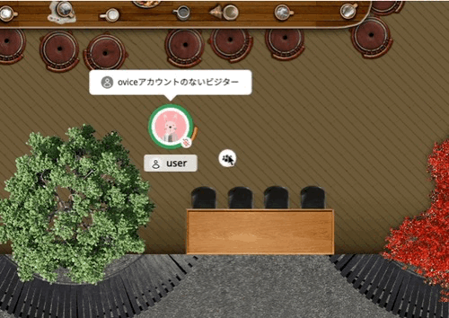
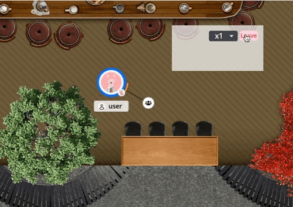
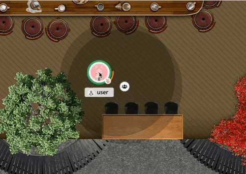

# Custom Plugins for ovice

## Contents

- [Overview](#overview)
- [Getting Started with Examples](#getting-started-with-examples)
- [Understanding Events](#understanding-events)
  - [Status Events](#status-events)
  - [Recommanded Initial connection Event](#recommended-initial-connection-events)
  - [Participant Related Events](#participant-related-events)
  - [Events for Participant Information](#events-for-participant-information)
  - [Real-time Communication Events](#real-time-communication-events)
  - [Event for Event Reflection](#event-for-event-reflection)
  - [Data Management Events (under development)](#data-management-events-under-development)

## Overview

This repository is aimed at developers who are interested in creating Custom Plugins for ovice, a platform that enables real-time interactions through a communication system leveraging iframe postMessage. The system provides a set of events to handle user participation, access participant information, and facilitate custom communication among users. It is designed to help developers integrate features easily and improve the user experience when interconnecting different domains.

## Getting Started with Examples

Here are some examples of plugins you can use as a reference for developing your own:

| Plugin Name                                         | Description                                                                       |
| --------------------------------------------------- | --------------------------------------------------------------------------------- |
| [Meeting Cash Clock](./examples/meeting-cash-clock) | A tool to monitor meeting cost in real-time.                                      |
| [RSS Reader](./examples/rss-reader)                 | An RSS feed plugin to read news or articles within ovice.                         |
| [Sound Track](./examples/soundtrack/)               | A plugin to play background music or soundtracks in the space.                    |
| [Fast Press Game](./examples/fast-press-game/)      | This is a quick press game for multiple people that can be used for quizzes, etc. |
| [Grouping](./examples/grouping/)                    | This is a tool that allows you to efficiently divide participants into groups.    |
| [Memo](./examples/memo/)                            | A simple memo app.                                                                |

## Understanding Events

### Status Events

These events notify about the status of users interacting with objects within ovice:

#### `subscribed`

User is within the range of the object but not linked.

#### `joined`

User is linked to the object.

#### `left`

User was linked but left the object.

#### `unsubscribed`

User was linked or within the range of the object but moved out of range.

### Recommended Initial connection Events

Events related to establishing the initial connection with ovice:

| Event Name                                                                                  | Triggered By  |
| :------------------------------------------------------------------------------------------ | :------------ |
| [ovice_get_participants](./docs/technical_details_for_developers.md#ovice_get_participants) | Client Domain |

### Participant Related Events

Events triggered by the ovice domain related to the actions of a participant:

| Event Name                                                                                                  | Triggered By |
| :---------------------------------------------------------------------------------------------------------- | :----------- |
| [ovice_participant_subscribed](./docs/technical_details_for_developers.md#ovice_participant_subscribed)     | ovice Domain |
| [ovice_participant_unsubscribed](./docs/technical_details_for_developers.md#ovice_participant_unsubscribed) | ovice Domain |
| [ovice_participant_joined](./docs/technical_details_for_developers.md#ovice_participant_joined)             | ovice Domain |
| [ovice_participant_left](./docs/technical_details_for_developers.md#ovice_participant_left)                 | ovice Domain |

### Events for Participant Information

Events designed to retrieve information about participants:

| Event Name                                                                                  | Triggered By  |
| :------------------------------------------------------------------------------------------ | :------------ |
| [ovice_get_participants](./docs/technical_details_for_developers.md#ovice_get_participants) | Client Domain |
| [ovice_participants](./docs/technical_details_for_developers.md#ovice_participants)         | ovice Domain  |

### Real-time Communication Events

Events facilitating real-time communication between participants:
| Event Name | Triggered By |
| :---------------------------------------------------------------------------------------- | :------------ |
| [ovice_broadcast_message](./docs/technical_details_for_developers.md#ovice_broadcast_message) | Client Domain |
| [ovice_emit_message](./docs/technical_details_for_developers.md#ovice_emit_message) | Client Domain |

### Event for Event Reflection

An event meant to reflect messages between participants:

| Event Name                                                                | Triggered By |
| :------------------------------------------------------------------------ | :----------- |
| [ovice_message](./docs/technical_details_for_developers.md#ovice_message) | ovice Domain |

### Data Management Events (under development)

Events in the ovice domain related to data management and storage actions:

| Event Name                                                                                      | Triggered By  |
| :---------------------------------------------------------------------------------------------- | :------------ |
| [ovice_get_data](./docs/technical_details_for_developers.md#ovice_get_data)                     | Client Domain |
| [ovice_saved_data](./docs/technical_details_for_developers.md#ovice_saved_data)                 | ovice Domain  |
| [ovice_save_and_emit_data](./docs/technical_details_for_developers.md#ovice_save_and_emit_data) | Client Domain |
| [ovice_shared_data](./docs/technical_details_for_developers.md#ovice_shared_data)               | ovice Domain  |
| [ovice_data_saved_success](./docs/technical_details_for_developers.md#ovice_data_saved_success) | ovice Domain  |
