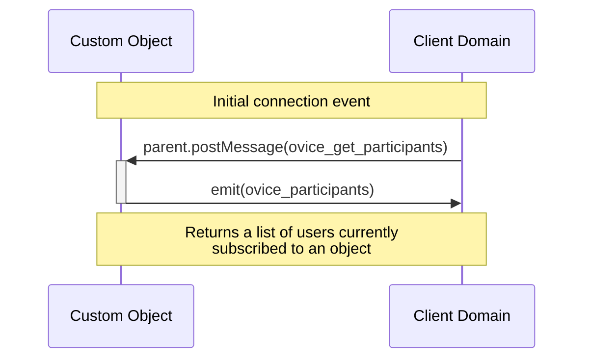
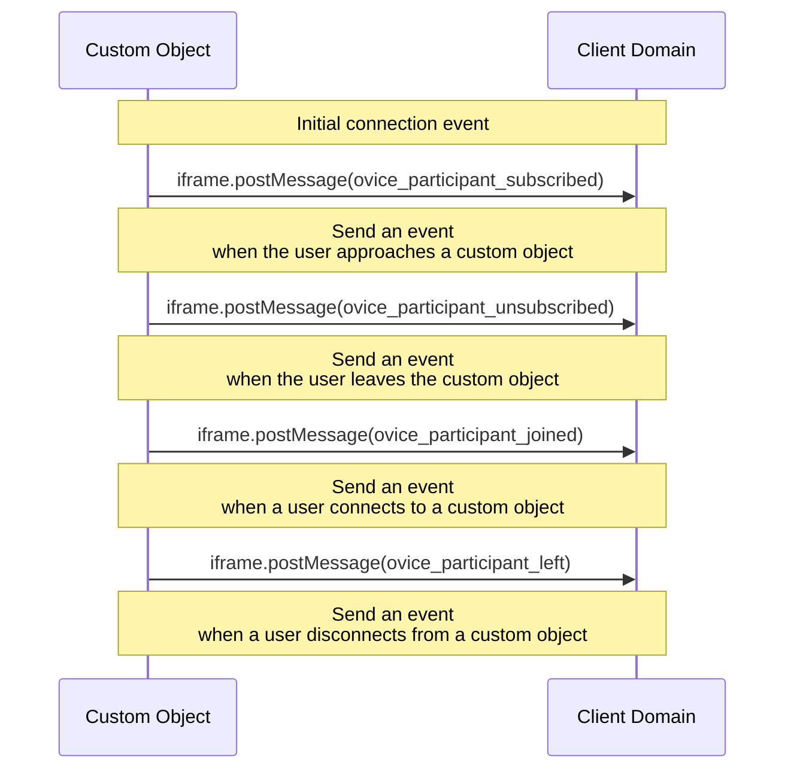
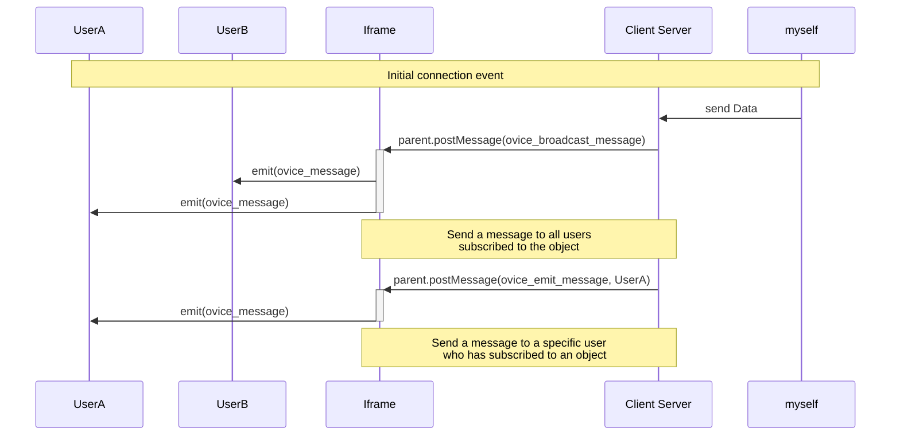
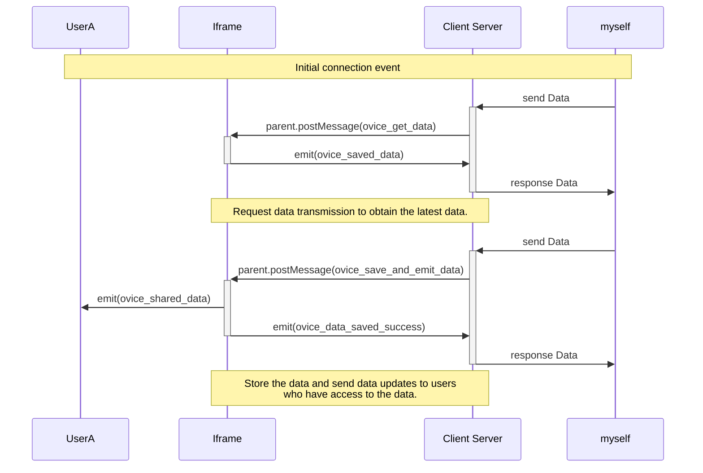

# Technical Details for Developers: Custom Plugins Integration

## Table of Contents

- [Overview](#overview)
- [Communication Mechanism](#communication-mechanism)
- [Event Handling](#event-handling)
  - [Connection Initialization Events](#connection-initialization-events)
  - [Participant Related Events](#participant-related-events)
  - [Other Participant Related Events](#other-participant-related-events)
  - [Participant Information Retrieval Events](#participant-information-retrieval-events)
  - [Real-time Communication Events](#real-time-communication-events)
  - [Reflected Event](#reflected-event)
  - [Data Management Events](#data-management-events)
- [Additional Information for Status:](#additional-information-for-status)

## Overview

This document outlines the technical specifications for developers integrating custom plugins with our platform. The integration is based on real-time communication between domains through iframe postMessage, enabling developers to create a seamless user experience.

## Communication Mechanism

The communication mechanism is designed for interaction between two domains via iframe. It includes:

- Exchange of events for participant management
- Information retrieval on participants
- Custom communication between users within their respective domains

## Event Handling

Explanation and specification of events are categorized based on their context.

### Participant Information Retrieval Events

Events to retrieve information about participants linked or subscribed to an object.
Note : We recommend using this event for initial communication.

#### Events Overview



#### `ovice_get_participants`

- **Description:** Triggered when the client's domain requests a list of participants, including the self-user, who have joined or subscribed to the object.

  ```json
  { "type": "ovice_get_participants" }
  ```

#### `ovice_participants`

- **Description:** Triggered when client requests a list of participants by sending `ovice_get_participants` event
- **Data Format: Array of Participants**

  - **id** (string or integer): Unique identifier of the user.
  - **objectId** (string): Unique identifier of the object that the user is associated with.
  - **objectType** (string): Represents the type of the object (static or dynamic).
  - **name** (string): Name of the user.
  - **avatarUrl** (string): Avatar icon of the user.
  - **workspaceId** (string): Workspace ID of the user.
  - **language** (string, optional): Preferred language of the user.
  - **status** (string, optional): Current connection status of the user.
  - **isHost** (boolean, optional): Indicates whether the user is the owner of the dynamic object.
  - **isSelf** (boolean, optional): represents if the user is self.
  - **isVisitor** (boolean): represents if the user is visitor or guest.

  ```json
  {
    "type": "ovice_participants",
    "payload": [
      {
        "id": "123456",
        "name": "John Doe",
        "objectId": "participantObjectId",
        "objectType": "static",
        "avatarUrl": "<https://example.com/avatar.jpg>",
        "workspaceId": 987,
        "isHost": false,
        "isSelf": true,
        "isVisitor": false,
        "status": "joined",
        "language": "en"
      },
      {
        "id": "123456",
        "name": "John Doe",
        "objectId": "participantObjectId",
        "objectType": "static",
        "avatarUrl": "<https://example.com/avatar.jpg>",
        "workspaceId": 987,
        "isHost": false,
        "isSelf": false,
        "isVisitor": true,
        "status": "subscribed",
        "language": "en"
      }
    ]
  }
  ```

### Participant Related Events

These events manage the current user's interaction with custom objects.

#### Events Overview



#### `ovice_participant_subscribed`

- **Description:** Triggered when the user who initiated the iframe subscribes to the object.
- **Data Format:**

  - **email** (string, conditional): Email address of the user. Provided only when the owner of the organization grants permission from the custom plugin setting page.
  - **id** (string or integer): Unique identifier of the user.
  - **objectId** (string): Unique identifier of the object that the user is associated with.
  - **objectType** (string): Represents the type of the object (static or dynamic).
  - **name** (string): Name of the user.
  - **avatarUrl** (string): Avatar icon of the user.
  - **workspaceId** (string): Workspace ID of the user.
  - **language** (string, optional): Preferred language of the user.
  - **isHost** (boolean, optional): Indicates whether the user is the owner of the dynamic object.
  - **isSelf** (boolean): represents if the user is self.
  - **isVisitor** (boolean): represents if the user is visitor or guest.

  ```json
  {
    "type": "ovice_participant_subscribed",
    "payload": {
      "id": "123456",
      "email": "[example@example.com](<mailto:example@example.com>)",
      "name": "John Doe",
      "objectId": "participantObjectId",
      "objectType": "dynamic",
      "avatarUrl": "https://example.com/avatar.jpg",
      "workspaceId": 987,
      "isHost": false,
      "isSelf": true,
      "isVisitor": true,
      "language": "en"
    }
  }
  ```

#### `ovice_participant_unsubscribed`

- **Description:** Triggered when the user who initiated the iframe unsubscribes from the object.
- **Data Format:**

  - **email** (string, conditional): Email address of the user. Provided only when the owner of the organization grants permission from the custom plugin setting page.
  - **id** (string or integer): Unique identifier of the user.
  - **objectId** (string): Unique identifier of the object that the user is associated with.
  - **objectType** (string): Represents the type of the object (static or dynamic).
  - **name** (string): Name of the user.
  - **avatarUrl** (string): Avatar icon of the user.
  - **workspaceId** (string): Workspace ID of the user.
  - **language** (string, optional): Preferred language of the user.
  - **isHost** (boolean, optional): Indicates whether the user is the owner of the dynamic object.
  - **isSelf** (boolean, optional): represents if the user is self.
  - **isVisitor** (boolean): represents if the user is visitor or guest.

  ```json
  {
    "type": "ovice_participant_unsubscribed",
    "payload": {
      "id": "123456",
      "email": "[example@example.com](<mailto:example@example.com>)",
      "name": "John Doe",
      "objectId": "participantObjectId",
      "objectType": "dynamic",
      "avatarUrl": "https://example.com/avatar.jpg",
      "workspaceId": 987,
      "isHost": false,
      "isSelf": true,
      "isVisitor": true,
      "language": "en"
    }
  }
  ```

#### `ovice_participant_joined`

- **Description:** Triggered when the user who initiated the iframe links to the object.
- **Data Format:**

  - **email** (string, conditional): Email address of the user. Provided only when the owner of the organization grants permission from the custom plugin setting page.
  - **id** (string or integer): Unique identifier of the user.
  - **objectId** (string): Unique identifier of the object that the user is associated with.
  - **objectType** (string): Represents the type of the object (static or dynamic).
  - **name** (string): Name of the user.
  - **avatarUrl** (string): Avatar icon of the user.
  - **workspaceId** (string): Workspace ID of the user.
  - **language** (string, optional): Preferred language of the user.
  - **isHost** (boolean, optional): Indicates whether the user is the owner of the dynamic object.
  - **isSelf** (boolean, optional): represents if the user is self.
  - **isVisitor** (boolean): represents if the user is visitor or guest.

  ```json
  {
    "type": "ovice_participant_joined",
    "payload": {
      "id": "123456",
      "email": "[example@example.com](<mailto:example@example.com>)",
      "name": "John Doe",
      "objectId": "participantObjectId",
      "objectType": "static",
      "avatarUrl": "<https://example.com/avatar.jpg>",
      "workspaceId": 987,
      "isHost": true,
      "isSelf": true,
      "isVisitor": true,
      "language": "en"
    }
  }
  ```

#### `ovice_participant_left`

- **Description:** Triggered when the user who initiated the iframe unlinks from the object.
- **Data Format:**

  - **email** (string, conditional): Email address of the user. Provided only when the owner of the organization grants permission from the custom plugin setting page.
  - **id** (string or integer): Unique identifier of the user.
  - **objectId** (string): Unique identifier of the object that the user is associated with.
  - **objectType** (string): Represents the type of the object (static or dynamic).
  - **name** (string): Name of the user.
  - **avatarUrl** (string): Avatar icon of the user.
  - **workspaceId** (string): Workspace ID of the user.
  - **language** (string, optional): Preferred language of the user.
  - **isHost** (boolean, optional): Indicates whether the user is the owner of the dynamic object.
  - **isSelf** (boolean, optional): represents if the user is self.
  - **isVisitor** (boolean): represents if the user is visitor or guest.

  ```json
  {
    "type": "ovice_participant_left",
    "payload": {
      "id": "123456",
      "email": "[example@example.com](<mailto:example@example.com>)",
      "name": "John Doe",
      "objectId": "participantObjectId",
      "objectType": "static",
      "avatarUrl": "<https://example.com/avatar.jpg>",
      "workspaceId": 987,
      "isHost": false,
      "isSelf": true,
      "isVisitor": true,
      "language": "en"
    }
  }
  ```

### Real-time Communication Events

Facilitate custom interactions among users who are linked or subscribed to the same object.

#### `ovice_broadcast_message`

- **Description:** Allows the client to send their own event to other users that are subscribed to or joined to the same object.
- **Payload:**
  - **source** (string): Identifier for the source of the event (user id).
  - **event** (string): The type of event being sent.
  - **objectId** (string): The unique identifier of the object.
  - **message** (unknown): The payload of the event, which can be a string, object, array, or number.
    - **Note:** The payload size for **`message`** is limited to 2MB.
- **Additional Behavior:**

  - When the targeted users receive this event, it will be reflected back to the client domain as an `ovice_message`. The payload of the `ovice_message` will include information about the source, event type, object identifier, and the original message payload.

  ```json
  {
    "type": "ovice_broadcast_message",
    "payload": {
      "source": "12",
      "event": "exampleEvent",
      "objectId": "L124",
      "message": {
        "key1": "value1",
        "key2": 42,
        "key3": ["item1", "item2"]
      }
    }
  }
  ```

#### `ovice_emit_message`

- **Description:** Allows the client to send their own event to a specific user who has joined or subscribed to the object.
- **Payload:**
  - **source** (string): Identifier for the source of the event (user id).
  - **event** (string): The type of event being sent.
  - **objectId** (string): The unique identifier of the object.
  - **message** (unknown): The payload of the event, which can be a string, object, array, or number.
    - **Note:** The payload size for **`message`** is limited to 2MB.
  - **to** (string): The identifier of the specific user to whom the event is targeted.
- **Additional Behavior:**

  - When the targeted user receives this event, it will be reflected back to the client domain as an `ovice_message`. The payload of the `ovice_message` will include information about the source, event type, object identifier, the original message payload, and the identifier of the user to whom the event was targeted (`to`).

  ```json
  {
    "type": "ovice_emit_message",
    "payload": {
      "source": "12",
      "event": "exampleEvent",
      "objectId": "L123",
      "message": {
        "key1": "value1",
        "key2": 42,
        "key3": ["item1", "item2"]
      },
      "to": "123"
    }
  }
  ```

### Reflected Event

#### Events Overview



#### `ovice_message`

- **Description:** Reflects events sent from the client to targeted users back to the client domain.
- **Payload:**

  - **source** (string): Identifier for the source of the reflected event.
  - **event** (string): The type of reflected event.
  - **objectId** (string): The unique identifier of the object.
  - **message** (unknown): The payload of the reflected event, which includes information about the original event.

  ```json
  {
    "type": "ovice_message",
    "payload": {
      "source": "12",
      "event": "exampleEvent",
      "objectId": "L123",
      "message": {
        "key1": "value1",
        "key2": 42,
        "key3": ["item1", "item2"]
      }
    }
  }
  ```

### Data Management Events

#### Events Overview



#### `ovice_get_data`

- **Description:** Triggered when a client's domain requests the latest data associated with an object.

  ```json
  { "type": "ovice_get_data" }
  ```

#### `ovice_saved_data`

- **Description:** Signifies that the requested data has been successfully retrieved and saved, confirming the completion of the data retrieval process.

- **Payload:**

  - **payload** (object): Data stored in the object
    - **Note:** The payload size for **`payload`** is limited to 500KB.

  ```json
  {
    "type": "ovice_saved_data",
    "payload": {
      "value1": "12",
      "value2": "test"
    }
  }
  ```

#### `ovice_save_and_emit_data`

- **Description:** Instructs the system to save the provided data and simultaneously emit an update to all relevant users who are subscribed to or monitoring the data.

- **Payload:**

  - **payload** (object): Data stored in the object
    - **Note:** The payload size for **`payload`** is limited to 500KB.

  ```json
  {
    "type": "ovice_save_and_emit_data",
    "payload": {
      "value1": "12",
      "value2": "test"
    }
  }
  ```

#### `ovice_shared_data`

- **Description:** Indicates that the data has been shared or made available to specific users who are part of the data-sharing process or have subscribed to receive updates.

- **Payload:**

  - **payload** (object): Data stored in the object
    - **Note:** The payload size for **`payload`** is limited to 500KB.

  ```json
  {
    "type": "ovice_shared_data",
    "payload": {
      "value1": "12",
      "value2": "test"
    }
  }
  ```

#### `ovice_data_saved_success`

- **Description:** Confirms that the data has been successfully saved in the system, ensuring that the data storage process is complete and reliable.

- **Payload:**

  - **payload** (object): Data stored in the object
    - **Note:** The payload size for **`payload`** is limited to 500KB.
  - **updated_at** (number, optional): Timestamp of updated date and time.

  ```json
  {
    "type": "ovice_data_saved_success",
    "payload": {
      "updated_at": 1703214224,
      "value1": "12",
      "value2": "test"
    }
  }
  ```

## Additional Information for Status:

- **"subscribed":** User is within the range of the object but not linked.
- **"joined":** User is linked to the object.
- **"left":** User was linked but left the object.
- **"unsubscribed":** User was linked or within the range of the object but moved out of range.
