# Technical Details for Developers ( Custom Plugins )

## **Overview**

The communication system facilitates real-time interaction between two domains using iframe postMessage. Events are exchanged to manage participants, gather participant information, and enable custom communication between users. This system allows seamless integration for developers to enhance user experiences across different domains.

## ****Events Related to Participant****


### `ovice_participant_subscribed`

- **Description:** Triggered when the user who initiated the iframe subscribes to the object.
- **Data Format:**
    - **email** (string, conditional): Email address of the user. Provided only when the owner of the organization grants permission from the custom plugin setting page.
    - **id** (string or integer): Unique identifier of the user.
    - **objectId** (string): Unique identifier of the object that the user is associated with.
    - **objectType** (string): Represents the type of the object (static or dynamic).
    - **name** (string): Name of the user.
    - **avatarUrl** (string): Avatar icon of the user.
    - **workspaceId** (string): Workspace ID of the user.
    - **language** (string, optional): Preferred language of the user.
    - **isHost** (boolean, optional): Indicates whether the user is the owner of the dynamic object.

```json
{
  "type": "ovice_participant_subscribed",
  "payload": {
    "id": "123456",
    "email": "[example@example.com](<mailto:example@example.com>)",
    "name": "John Doe",
    "objectId": "participantObjectId",
    "objectType": "dynamic",
    "avatarUrl": "<https://example.com/avatar.jpg>",
    "workspaceId": 987,
    "isHost": false,
    "language": "en"
  }
}
```

### `ovice_participant_unsubscribed`

- **Description:** Triggered when the user who initiated the iframe unsubscribes from the object.
- **Data Format:**
    - **email** (string, conditional): Email address of the user. Provided only when the owner of the organization grants permission from the custom plugin setting page.
    - **id** (string or integer): Unique identifier of the user.
    - **objectId** (string): Unique identifier of the object that the user is associated with.
    - **objectType** (string): Represents the type of the object (static or dynamic).
    - **name** (string): Name of the user.
    - **avatarUrl** (string): Avatar icon of the user.
    - **workspaceId** (string): Workspace ID of the user.
    - **language** (string, optional): Preferred language of the user.
    - **isHost** (boolean, optional): Indicates whether the user is the owner of the dynamic object.

```json
{
  "type": "ovice_participant_unsubscribed",
  "payload": {
    "id": "123456",
    "email": "[example@example.com](<mailto:example@example.com>)",
    "name": "John Doe",
    "objectId": "participantObjectId",
    "objectType": "dynamic",
    "avatarUrl": "<https://example.com/avatar.jpg>",
    "workspaceId": 987,
    "isHost": false,
    "language": "en"
  }
}
```

### `ovice_participant_joined`

- **Description:** Triggered when the user who initiated the iframe links to the object.
- **Data Format:**
    - **email** (string, conditional): Email address of the user. Provided only when the owner of the organization grants permission from the custom plugin setting page.
    - **id** (string or integer): Unique identifier of the user.
    - **objectId** (string): Unique identifier of the object that the user is associated with.
    - **objectType** (string): Represents the type of the object (static or dynamic).
    - **name** (string): Name of the user.
    - **avatarUrl** (string): Avatar icon of the user.
    - **workspaceId** (string): Workspace ID of the user.
    - **language** (string, optional): Preferred language of the user.
    - **isHost** (boolean, optional): Indicates whether the user is the owner of the dynamic object.

```json
{
  "type": "ovice_participant_joined",
  "payload": {
    "id": "123456",
    "email": "[example@example.com](<mailto:example@example.com>)",
    "name": "John Doe",
    "objectId": "participantObjectId",
    "objectType": "static",
    "avatarUrl": "<https://example.com/avatar.jpg>",
    "workspaceId": 987,
    "isHost": true,
    "language": "en"
  }
}
```

### `ovice_participant_left`

- **Description:** Triggered when the user who initiated the iframe unlinks from the object.
- **Data Format:**
    - **email** (string, conditional): Email address of the user. Provided only when the owner of the organization grants permission from the custom plugin setting page.
    - **id** (string or integer): Unique identifier of the user.
    - **objectId** (string): Unique identifier of the object that the user is associated with.
    - **objectType** (string): Represents the type of the object (static or dynamic).
    - **name** (string): Name of the user.
    - **avatarUrl** (string): Avatar icon of the user.
    - **workspaceId** (string): Workspace ID of the user.
    - **language** (string, optional): Preferred language of the user.
    - **isHost** (boolean, optional): Indicates whether the user is the owner of the dynamic object.

```json
{
  "type": "ovice_participant_left",
  "payload": {
    "id": "123456",
    "email": "[example@example.com](<mailto:example@example.com>)",
    "name": "John Doe",
    "objectId": "participantObjectId",
    "objectType": "static",
    "avatarUrl": "<https://example.com/avatar.jpg>",
    "workspaceId": 987,
    "isHost": false,
    "language": "en"
  }
}
```

## ****Events Related to other Participant****


### `ovice_other_participant_subscribed`

- **Description:** Triggered when another user (not the initiator of the iframe) subscribes to the object.
- **Data Format:**
    - **id** (string or integer): Unique identifier of the user.
    - **objectId** (string): Unique identifier of the object that the user is associated with.
    - **objectType** (string): Represents the type of the object (static or dynamic).
    - **name** (string): Name of the user.
    - **avatarUrl** (string): Avatar icon of the user.
    - **workspaceId** (string): Workspace ID of the user.
    - **language** (string, optional): Preferred language of the user.
    - **isHost** (boolean, optional): Indicates whether the user is the owner of the dynamic object.

```json
{
  "type": "ovice_other_participant_subscribed",
  "payload": {
    "id": "123456",
    "name": "John Doe",
    "objectId": "participantObjectId",
    "objectType": "static",
    "avatarUrl": "<https://example.com/avatar.jpg>",
    "workspaceId": 987,
    "isHost": false,
    "language": "en"
  }
}
```

### `ovice_other_participant_unsubscribed`

- **Description:** Triggered when another user (not the initiator of the iframe) unsubscribes from the object.
- **Data Format:**
    - **id** (string or integer): Unique identifier of the user.
    - **objectId** (string): Unique identifier of the object that the user is associated with.
    - **objectType** (string): Represents the type of the object (static or dynamic).
    - **name** (string): Name of the user.
    - **avatarUrl** (string): Avatar icon of the user.
    - **workspaceId** (string): Workspace ID of the user.
    - **language** (string, optional): Preferred language of the user.
    - **isHost** (boolean, optional): Indicates whether the user is the owner of the dynamic object.

```json
{
  "type": "ovice_other_participant_unsubscribed",
  "payload": {
    "id": "123456",
    "name": "John Doe",
    "objectId": "participantObjectId",
    "objectType": "static",
    "avatarUrl": "<https://example.com/avatar.jpg>",
    "workspaceId": 987,
    "isHost": false,
    "language": "en"
  }
}
```

### `ovice_other_participant_joined`

- **Description:** Triggered when another user (not the initiator of the iframe) links to the object.
- **Data Format:**
    - **id** (string or integer): Unique identifier of the user.
    - **objectId** (string): Unique identifier of the object that the user is associated with.
    - **objectType** (string): Represents the type of the object (static or dynamic).
    - **name** (string): Name of the user.
    - **avatarUrl** (string): Avatar icon of the user.
    - **workspaceId** (string): Workspace ID of the user.
    - **language** (string, optional): Preferred language of the user.
    - **isHost** (boolean, optional): Indicates whether the user is the owner of the dynamic object.

```json
{
  "type": "ovice_other_participant_joined",
  "payload": {
    "id": "123456",
    "name": "John Doe",
    "objectId": "participantObjectId",
    "objectType": "static",
    "avatarUrl": "<https://example.com/avatar.jpg>",
    "workspaceId": 987,
    "isHost": false,
    "language": "en"
  }
}
```

### `ovice_other_participant_left`

- **Description:** Triggered when another user (not the initiator of the iframe) unlinks from the object.
- **Data Format:**
    - **id** (string or integer): Unique identifier of the user.
    - **objectId** (string): Unique identifier of the object that the user is associated with.
    - **objectType** (string): Represents the type of the object (static or dynamic).
    - **name** (string): Name of the user.
    - **avatarUrl** (string): Avatar icon of the user.
    - **workspaceId** (string): Workspace ID of the user.
    - **language** (string, optional): Preferred language of the user.
    - **isHost** (boolean, optional): Indicates whether the user is the owner of the dynamic object.

```json
{
  "type": "ovice_other_participant_left",
  "payload": {
    "id": "123456",
    "name": "John Doe",
    "objectId": "participantObjectId",
    "objectType": "static",
    "avatarUrl": "<https://example.com/avatar.jpg>",
    "workspaceId": 987,
    "isHost": false,
    "language": "en"
  }
}
```

## ****Events for Participant Information Retrieval****

### `ovice_get_participants`


- **Description:** Triggered when the client's domain requests a list of participants, including the self-user, who have joined or subscribed to the object.

```json
{ "type" : "ovice_get_participants" }
```

### `ovice_participants`

- **Description:** Triggered when client requests a list of participants by sending `ovice_get_participants` event
- **Data Format: Array of Participants**
    - **id** (string or integer): Unique identifier of the user.
    - **objectId** (string): Unique identifier of the object that the user is associated with.
    - **objectType** (string): Represents the type of the object (static or dynamic).
    - **name** (string): Name of the user.
    - **avatarUrl** (string): Avatar icon of the user.
    - **workspaceId** (string): Workspace ID of the user.
    - **language** (string, optional): Preferred language of the user.
    - **status** (string, optional): Current connection status of the user.
    - **isHost** (boolean, optional): Indicates whether the user is the owner of the dynamic object.
    
    ```json
    {
      "type": "ovice_participants",
      "payload": [
        {
          "id": "123456",
          "name": "John Doe",
          "objectId": "participantObjectId",
          "objectType": "static",
          "avatarUrl": "<https://example.com/avatar.jpg>",
          "workspaceId": 987,
          "isHost": false,
          "status": "joined",
          "language": "en"
        },
        {
          "id": "123456",
          "name": "John Doe",
          "objectId": "participantObjectId",
          "objectType": "static",
          "avatarUrl": "<https://example.com/avatar.jpg>",
          "workspaceId": 987,
          "isHost": false,,
          "status": "subscribed",
          "language": "en"
        }
      ]
    }
    
    ```
    

## **Additional Information for Status:**

- **"subscribed":** User is within the range of the object but not linked.
- **"joined":** User is linked to the object.
- **"left":** User was linked but left the object.
- **"unsubscribed":** User was linked or within the range of the object but moved out of range.

## Real-time Communication Events

### `ovice_emit_to_others`

- **Description:** Allows the client to send their own event to other users that are subscribed to or joined to the same object.
- **Payload:**
    - **source** (string): Identifier for the source of the event (user id).
    - **event** (string): The type of event being sent.
    - **objectId** (string): The unique identifier of the object.
    - **message** (unknown): The payload of the event, which can be a string, object, array, or number.
        - **Note:** The payload size for **`message`** is limited to 2MB.
- **Additional Behavior:**
    - When the targeted users receive this event, it will be reflected back to the client domain as an `ovice_event_message`. The payload of the `ovice_event_message` will include information about the source, event type, object identifier, and the original message payload.

```json
{
   "type":"ovice_emit_to_others",
   "payload":{
      "source":"12",
      "event":"exampleEvent",
      "objectId":"L124",
      "message":{
         "key1":"value1",
         "key2":42,
         "key3":[
            "item1",
            "item2"
         ]
      }
   }
}
```

### `ovice_emit_to`

- **Description:** Allows the client to send their own event to a specific user who has joined or subscribed to the object.
- **Payload:**
    - **source** (string): Identifier for the source of the event (user id).
    - **event** (string): The type of event being sent.
    - **objectId** (string): The unique identifier of the object.
    - **message** (unknown): The payload of the event, which can be a string, object, array, or number.
        - **Note:** The payload size for **`message`** is limited to 2MB.
    - **to** (string): The identifier of the specific user to whom the event is targeted.
- **Additional Behavior:**
    - When the targeted user receives this event, it will be reflected back to the client domain as an `ovice_event_message`. The payload of the `ovice_event_message` will include information about the source, event type, object identifier, the original message payload, and the identifier of the user to whom the event was targeted (`to`).

```json
{
   "type":"ovice_emit_to",
   "payload":{
      "source":"12",
      "event":"exampleEvent",
      "objectId":"L123",
      "message":{
         "key1":"value1",
         "key2":42,
         "key3":[
            "item1",
            "item2"
         ]
      },
      "**to**":"123"
   }
}
```

## Reflection Event

### `ovice_event_message`

```mermaid
sequenceDiagram
		participant UserA
		participant UserB
		participant Iframe
    participant Client Server
		participant myself

		Note over UserA, myself: Initial connection event

		myself->>Client Server: send Data
    Client Server->>+Iframe: parent.postMessage(ovice_emit_to_others)
    Iframe->>UserB: emit(ovice_event_message)
		Iframe->>-UserA: emit(ovice_event_message)
    Note over Client Server,Iframe: Send a message to all users <br />subscribed to the object

		Client Server->>+Iframe: parent.postMessage(ovice_emit_to, UserA)
    Iframe->>-UserA: emit(ovice_event_message)
    Note over Client Server,Iframe: Send a message to a specific user <br />　who has subscribed to an object
```



- **Description:** Reflects events sent from the client to targeted users back to the client domain.
- **Payload:**
    - **source** (string): Identifier for the source of the reflected event.
    - **event** (string): The type of reflected event.
    - **objectId** (string): The unique identifier of the object.
    - **message** (unknown): The payload of the reflected event, which includes information about the original event.

```json
{
   "type":"ovice_event_message",
   "payload":{
      "source":"12",
      "event":"exampleEvent",
      "objectId":"L123",
      "message":{
         "key1":"value1",
         "key2":42,
         "key3":[
            "item1",
            "item2"
         ]
      }
   }
}
```

## Initial connection event (in preparation)


### `ovice_ready`

- **Description:** Client sends an event when is ready to connect.

```json
{
   "type":"ovice_ready"
}
```

### `ovice_confirmation`

- **Description:** Reflects in the client domain that the connection with the client has started.

```json
{
   "type":"ovice_confirmation"
}
```

### `ovice_ready_confirmed`

- **Description:** Sends an event indicating that the connection with the client has been completed.

```json
{
   "type":"ovice_ready_confirmed"
}
```